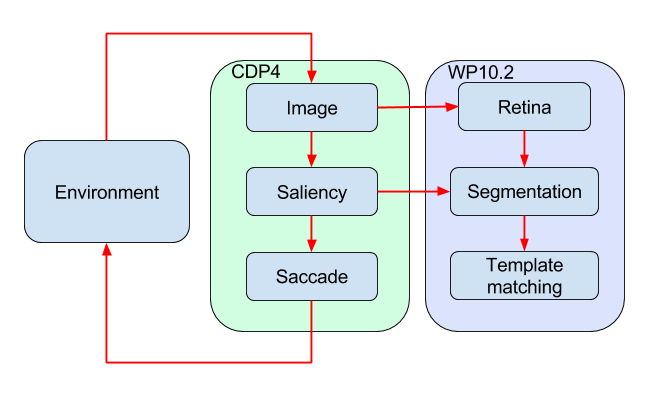

CDP4 experiment on the NRP
====================

This repository contains the highlight CDP4 experiment on the NRP.
Here is a block diagram of the components that will be integrated in this experiment for March 2018:

Installation
-----------

* Go to experiments folder: `cd NRP/Experiments/` (`cd $NRP_EXPERIMENTS_DIRECTORY`)
* Clone repository: `git clone https://github.com/HBPNeurorobotics/CDP4_experiment.git`
* Enter repository: `cd CDP4_experiments`
* Run `./install.sh`

Usage
-----

See nrp.launch for the different nodes provided:
* embodied_attention saliency.py - converts camera input to saliency map
* embodied_attention curiosity.py - modifies saliency map for more exploration
* embodied_attention saccade.py - converts saliency map to saccade targets
* embodied_attention attention.py - moves eyes of robot, initiates object identification, stores information in memory
* embodied_attention recognize.py - provides object recognition
* ros_holographic visual_memory_module.py - provides memory
* embodied_attention visualizer.py - brief visualization of saliency and saccade mechanism

For timing reasons, the saliency and saccade models are also available in transfer functions image_to_saccade*.py
